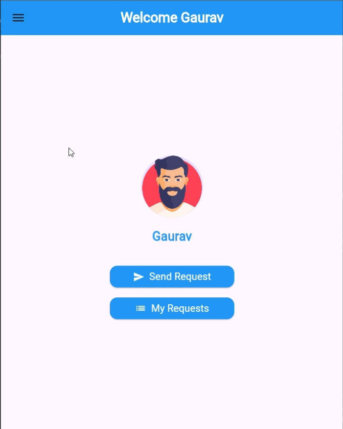
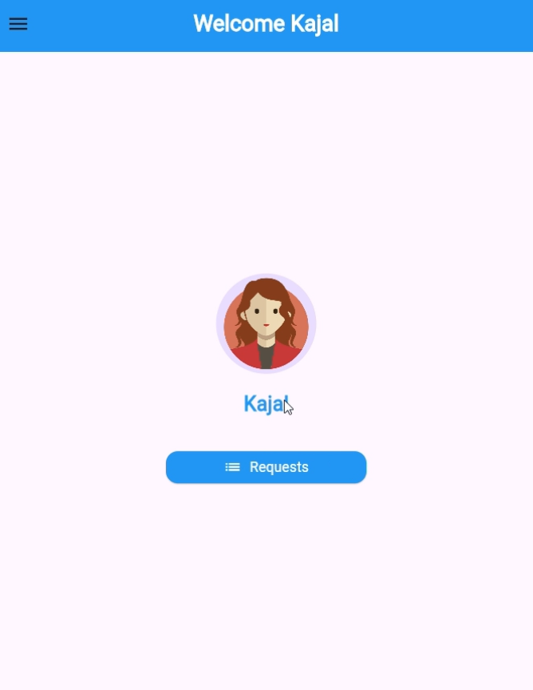
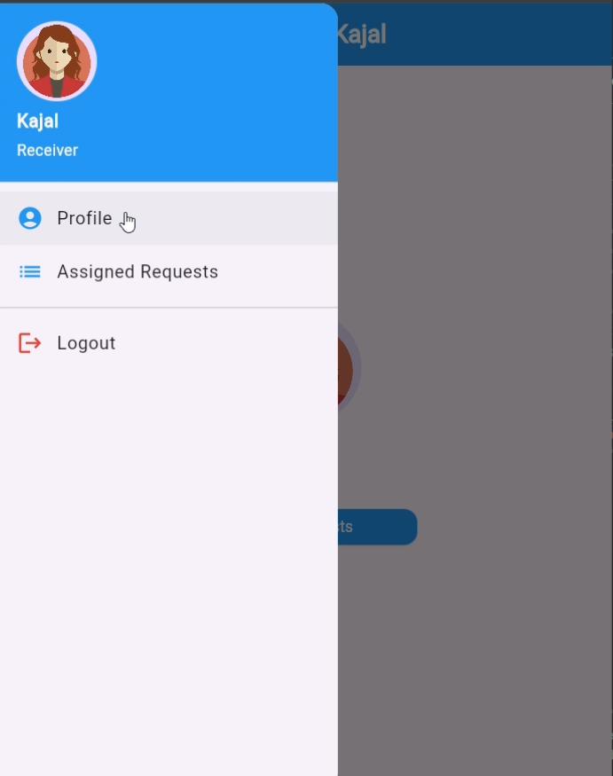
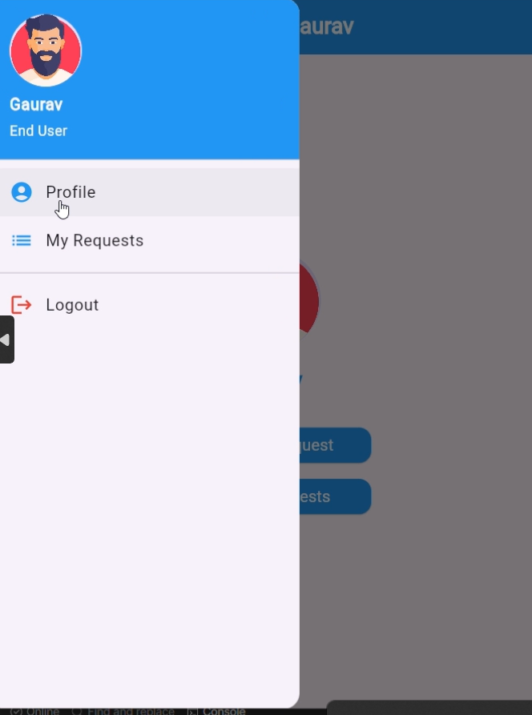
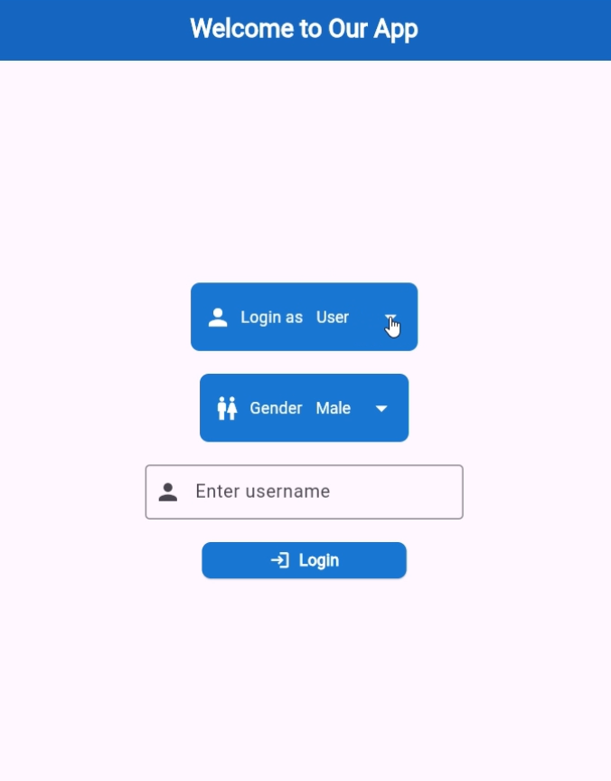
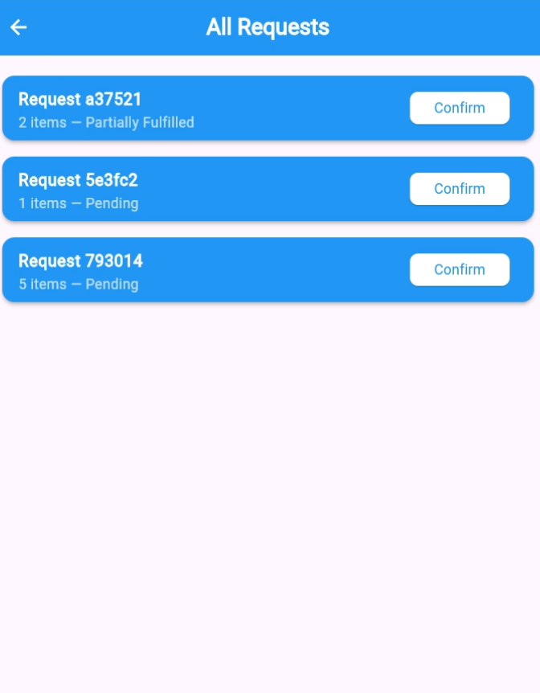

# RequestHandlingFlutterApp

A Flutter-based mobile application that simulates a real-world **request and confirmation workflow**. The app supports two distinct roles: **End User** and **Receiver**, enabling efficient tracking of requests and their statuses without using Firebase.

---

## Table of Contents
- [Objective](#objective)
- [Roles & Features](#roles--features)
  - [End User](#end-user)
  - [Receiver](#receiver)
- [General System Requirements](#general-system-requirements)
  - [Backend / Mock Server](#backend--mock-server)
  - [Real-Time Updates](#real-time-updates)
  - [Authentication](#authentication)
  - [State Management](#state-management)
  - [Error Handling](#error-handling)
  - [UI/UX](#uiux)
- [Deliverables](#deliverables)
- [Technologies Used](#technologies-used)
- [Setup & Installation](#setup--installation)
- [Screenshots](#screenshots)
- [Demo Video](#demo-video)
- [License](#license)

---

## Objective

The goal of this project is to build a **prototype mobile application** using Flutter that simulates a real-world request and confirmation workflow. The app supports two roles with distinct functionalities:  

- **End User:** Submits requests containing multiple items.  
- **Receiver:** Reviews requests and confirms the availability of items individually.  

The system tracks request statuses: **Pending**, **Confirmed**, and **Partially Fulfilled**, and handles partial confirmations by reassigning unconfirmed items.

---

## Roles & Features

### End User
The End User represents a person making requests for multiple items.  

**Features:**
- Create a new request by selecting multiple items.  
- Submit requests to the system.  
- View submitted requests with their current statuses:
  - **Pending:** Request submitted, awaiting receiver review.  
  - **Confirmed:** All items confirmed by the receiver.  
  - **Partially Fulfilled:** Some items confirmed, others reassigned.  
- Track real-time progress of request status (without Firebase).  

---

### Receiver
The Receiver reviews and fulfills requests assigned to them.  

**Features:**
- View all new requests assigned to them.  
- Open a request and review each item individually.  
- Confirm availability of items (mark as **Available / Not Available**).  
- Submit confirmation results back to the system.  
- Request status logic:
  - **Confirmed:** All items are confirmed.  
  - **Partially Fulfilled:** Some items confirmed; unconfirmed items are reassigned.  

---

## General System Requirements

### Backend / Mock Server
- A simple backend (Node.js/Express, Django, or mock JSON server) is used to store requests and manage status updates.  
- Endpoints include:
  - **Create Request**  
  - **Fetch Requests** (per role)  
  - **Update Confirmation Status**  

### Real-Time Updates
- Real-time updates of request statuses without Firebase.  
- Approaches:
  - **Polling** at regular intervals  
  - **WebSockets** (preferred)  

### Authentication
- Basic login system differentiates **End User** and **Receiver** roles.  
- Simple role-based authentication; OAuth is not required.  

### State Management
- Uses **Riverpod** or **Provider** for clean and maintainable state management.  

### Error Handling
Handles edge cases such as:  
- Network failure  
- Request submission errors  
- Receiver submitting incomplete confirmations  

### UI/UX
- Simple, minimal, and professional interface.  
- Focuses on **clarity over design complexity** for easy usability.

---

## Deliverables
1. **Flutter Mobile Application**  
   - Both **End User** and **Receiver** roles implemented.  
   - Real-time updates functional without Firebase.  

2. **Backend / Mock Service**  
   - Supports request creation, confirmation, and status tracking.  
   - Handles **partial fulfillment** by reassigning unconfirmed items.

---

## Technologies Used
- **Flutter** - Cross-platform mobile development  
- **Dart** - Programming language  
- **Node.js / Django / Mock Server** - Backend for request management  
- **Provider / Riverpod** - State management  
- **WebSockets / Polling** - Real-time updates  

---
## Screenshots

### End User App
  
**Description:** Submit requests containing multiple items, view status updates, and track progress in real-time.

### Receiver App
  
**Description:** Review requests item by item, confirm availability, and manage partially fulfilled requests.

### General UI
  
  
  
  
**Description:** Clean and minimal interface focusing on usability and clarity.

Demo Video
Watch the full workflow of the app in action:
[](https://drive.google.com/file/d/1zSAbxUrpWiIBtjhBmyucIRE-Cg9hwuU1/preview)

Description: Shows both End User and Receiver roles interacting with the system, real-time status updates, and backend workflow.


## Setup & Installation

1. Clone the repository:
```bash
git clone https://github.com/your-username/RequestHandlingFlutterApp.git
